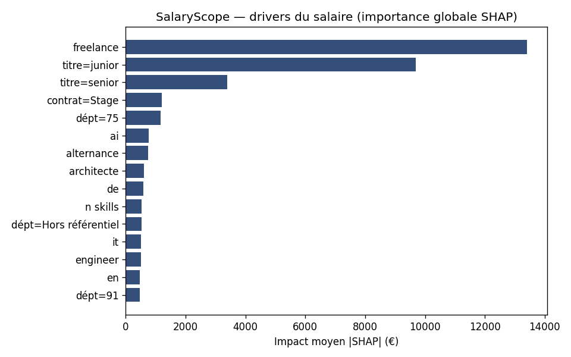
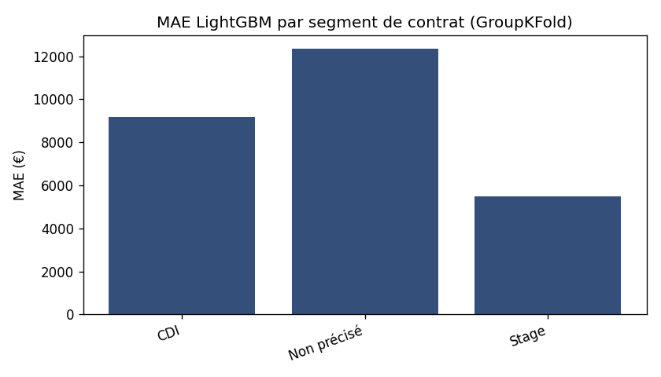
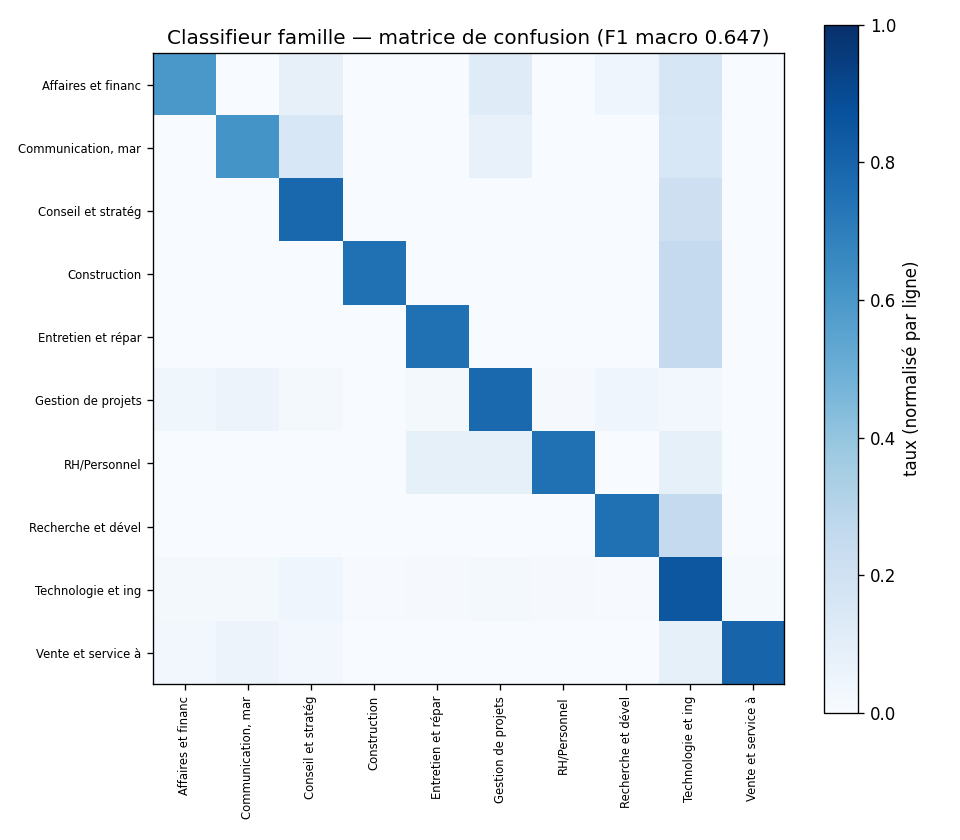

# SalaryScope IDF — estimation salariale, explicabilité & matching (Module 03)

> **Module Data Science / ML de la plateforme [CartoData IDF](../README.md).** « Avant même de postuler chez vous, j'ai modélisé le salaire de marché de VOTRE propre poste sur ~1 800 offres concurrentes Data/IA d'Île-de-France : tapez un intitulé, le modèle sort le salaire attendu, son **intervalle**, son **percentile marché** et les **3 facteurs SHAP** qui le tirent. »

Ce module **consomme le dataset GOLD produit par le module 01** (`01-data-engineering`) — salaires déjà annualisés, dédupliqués, géo-résolus — et en fait un **produit data scientist de bout en bout** : régression + explicabilité + classification NLP + matching, servis en API et en démo interactive. Une donnée maîtrisée, amortie sur une famille de postes de plus.

---

## 🎯 Résultats (validation honnête, GroupKFold par entreprise)

**1 845 salaires** exploitables · **859 entreprises** (groupes de CV) · médiane marché **49 000 €** (Q1 29,7 k / Q3 65 k).

| Modèle | MAE | MAPE | RMSE |
|---|--:|--:|--:|
| Baseline médiane globale | 24 121 € | 67,5 % | 33 646 € |
| Médiane par tranche d'exp. | 23 992 € | 66,7 % | 33 382 € |
| Ridge (linéaire) | 13 055 € | 30,5 % | 20 412 € |
| **LightGBM (servi)** | **11 567 €** | **25,5 %** | **19 285 €** |

→ **−52 % de MAE vs baseline.** MAE **par segment** (le réflexe qui compte) : **CDI 9 160 € (MAPE 15,0 %)** · Stage 5 490 € · postes sans contrat affiché 12 363 €.

**Classifieur de famille** (profession.fr, 10 classes) : **F1 macro 0,647 · micro 0,809**.





---

## 🧠 Les 4 briques (périmètre fini, chacune défendable)

1. **Régresseur de salaire** — cible = salaire annualisé médian **en €** (valeurs SHAP en €). LightGBM objectif **L1** (robuste aux salaires sales). **Validation anti-fuite : GroupKFold par entreprise** (deux offres d'un même employeur ne sont jamais à cheval train/test → pas de fuite via l'ATS). **Intervalles de prédiction** par régression quantile q10/q90 (80 %).
2. **Explicabilité SHAP** — `TreeExplainer` → contributions additives en € : *« Senior +X k, Paris +Y k, Stage −Z k »*. Une prédiction qui PARLE.
3. **Classifieur famille (NLP)** — TF-IDF + régression logistique sur **profession.fr** (ground truth propre). F1 macro/micro + matrice de confusion. *CamemBERT documenté en option (model-card) — pas survendu sur ce volume.*
4. **Matching « Where do I stand »** — cosinus TF-IDF sur les intitulés → k offres les plus proches + **percentile marché** + indice de **tension** par segment. C'est ce qui transforme le modèle en produit.

---

## 🧰 Stack
Python 3.11 · pandas/numpy · **scikit-learn** (pipelines, GroupKFold, métriques) · **LightGBM** (régresseur + quantiles) · **SHAP** (explicabilité) · TF-IDF (NLP) · **FastAPI** (API de scoring) · **Streamlit** (démo) · **MLflow**/JSON (tracking) · joblib (sérialisation) · matplotlib (figures).

## 📁 Arborescence
```
03-salaryscope-ml/
├── src/salaryscope/
│   ├── data.py         lecture du GOLD (module 01)
│   ├── features.py     features interprétables + séniorité/stack (titre)
│   ├── regressor.py    LightGBM vs baselines, GroupKFold, intervalles quantiles
│   ├── explain.py      drivers SHAP (en €)
│   ├── classifier.py   TF-IDF + LogReg (profession.fr)
│   ├── matching.py     cosinus + percentile marché + tension
│   ├── service.py      inférence (API + démo)
│   ├── api.py          FastAPI  ·  cost_of_living.py / tracking.py
├── app.py              démo Streamlit
├── scripts/train.py    entraînement complet -> models/ + metrics/ + figures/
├── models/  metrics/  docs/figures/      (modèle servi + chiffres réels + visuels)
├── tests/              pytest (features, régresseur, matching, classifieur, API)
└── model-card.md · RECAP.md · README.md
```

## 🚀 Démarrage
```powershell
py -m pip install -r requirements.txt ; py -m pip install -e .
py scripts/train.py                         # ré-entraîne (lit le GOLD du module 01)
uvicorn salaryscope.api:app --reload        # API  -> http://localhost:8000/docs
streamlit run app.py                        # démo -> http://localhost:8501
py -m ruff check . ; py -m pytest
```
> Le module lit `../01-data-engineering/data/gold/fct_offres.parquet` (ou `$GOLD_PARQUET`). Les **modèles servis sont commités** (`models/`) : l'API et la démo tournent sans ré-entraîner.

## ⚠️ Limites assumées (cf. `model-card.md`)
Biais de sélection (les offres qui **affichent** un salaire ne sont pas représentatives) · couverture salaire ~24 % du marché · ~78 % des labels viennent d'Indeed (peu de métadonnées) · pas de deep learning sur ~1 800 lignes (discipline > complexité) · fusion DVF = feature **contextuelle** au département (`cost_of_living.py`), intégration DVF complète en backlog.

---
*Données = offres d'emploi publiques. Aucune information personnelle. Dépôt public-safe.*
